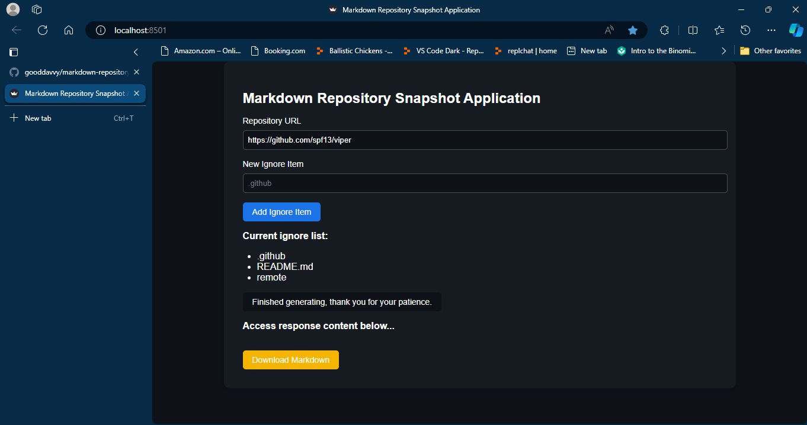

> **Note: This project will soon deprecate the use of Python, and will only use GoLang. In short words, it will soon only use Go.**

# markdown-repository-snapshot-app

Hi and welcome to `markdown-repository-snapshot-app`! 👋👋👋👋👋

## Description & Details

This is an application that you input a GitHub repository's URL into, alongside ignore files&folders, and it outputs a downloadable `output.md` file, which contains this a snapshot of the non-excluded files. Here are the latest updates:

- As of **May 19, 2024**, you do not need a GitHub API key in order to use the application (even though it still requires an internet connection).

**Feels like magic!**

Release Date: May 17, 2024

Phase: Completed (sort of)

**Need to work on:**

- [x] Making it work via GitHub API and GitHub API token
- [x] Doing it via getting and unzipping zip file for repository (**the magical part**)

**Feel free to look at the code--the app is all open-source!**

**Just a heads up:** If you don't feel like running it, why don't you look at the image below? It really works! And it's really, _really_ fast! (**Trust me**, you can generate the snapshot in a maximum of only 4 seconds, no matter how big the repository is.)



# How to use

## Setting it up

1. First, ensure you have installed [GoLang](https://go.dev/dl/) and [Python](https://python.org/downloads/).
2. After this, you can open your terminal, navigate to the desired directory, and run:

```sh
git clone https://github.com/gooddavvy/markdown-repository-snapshot-app
cd markdown-repository-snapshot-app
code .
```

## Running it

Then, open a VS-Code terminal in the workspace, and run:

```sh
cd backend
go mod tidy
go run main.go
```

After that, open another one, and run:

```sh
cd frontend
pip install -r requirements.txt
python app.py
```

If everything works as expected, it should automatically open `http://localhost:8501` in your default browser.

# Contributions & Stars

Contributions are welcome! If you find any issues or have suggestions for improvements, please create a [new issue](https://github.com/gooddavvy/markdown-repository-snapshot-app/issues/new) or submit a [pull request](https://github.com/gooddavvy/markdown-repository-snapshot-app/pulls).

Also, if you like and/or support this project, please [star it](https://github.com/gooddavvy/markdown-repository-snapshot-app)!
